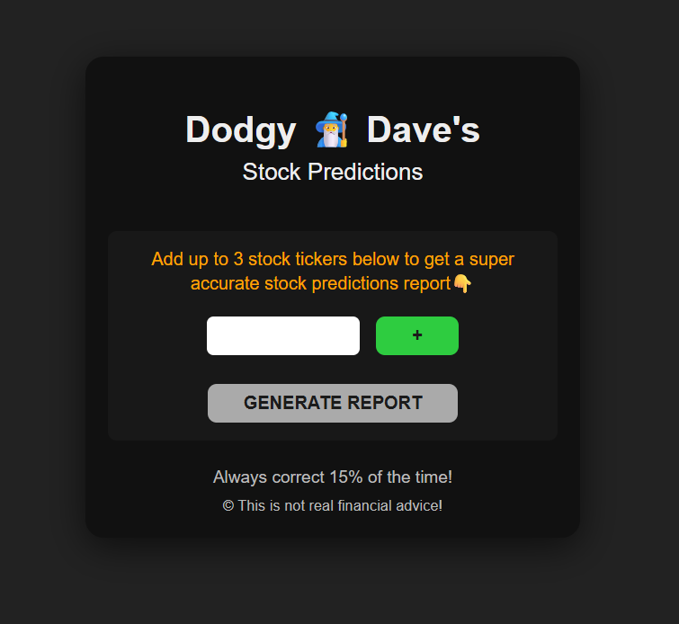

# Dodgy Dave's Stock Predictions 🧙‍♂️

A simple, humorous web application that uses AI to generate "dodgy" stock predictions. Users can enter stock tickers, and the app fetches recent market data from the **Polygon.io API** and sends it to the **Google Gemini API** for a "buy," "hold," or "sell" recommendation.

## Screenshot



## Features

  * Enter one or more stock tickers (e.g., `TSLA`, `AAPL`).
  * Fetches the last 3 days of stock data from the Polygon.io API.
  * Uses the Google Gemini API (`gemini-2.5-flash`) to analyze the data.
  * Generates a short, AI-written report with a "buy," "hold," or "sell" recommendation.
  * Simple, clean, dark-mode UI.
  * Loading spinner and status messages while fetching data.

## How it Works

1.  The user enters stock tickers in the browser.
2.  `index.js` fetches historical data for the past 3 days from the [Polygon.io API](https://polygon.io/).
3.  The collected data is compiled and sent to the [Google Gemini API](https://ai.google.dev/).
4.  A prompt in `index.js` instructs the AI to act as a "trading guru" and provide a brief analysis.
5.  The AI's response is then rendered on the page.

## Technologies Used

  * **Frontend:** HTML5, CSS3, Vanilla JavaScript (ES Modules)
  * **APIs:**
      * [Polygon.io API](https://polygon.io/) for stock market data.
      * [Google Gemini API](https://ai.google.dev/) for AI-generated analysis.

## Setup and Installation

To run this project locally, you'll need to follow these steps.

### 1\. Clone the Repository

```bash
git clone https://github.com/your-username/your-repository-name.git
cd your-repository-name
```

### 2\. Get API Keys

This project requires **two** separate API keys:

1.  **Polygon.io API Key:** Sign up for a free account at [Polygon.io](https://polygon.io/) to get an API key.
2.  **Google Gemini API Key:** Get an API key from [Google AI Studio](https://aistudio.google.com/app/apikey).

### 3\. Add Your API Keys

You must add your API keys to `index.js` in two places.

  * **In the `fetchStockData` function:** Replace `Your_api_key` with your **Polygon.io** API key.

    ```javascript
    // index.js
    const url = `https://api.polygon.io/v2/aggs/ticker/${ticker}/range/1/day/${dates.startDate}/${dates.endDate}?apiKey=YOUR_POLYGON_API_KEY_HERE`;
    ```

  * **In the `fetchReport` function:** Replace `Your_api_key` with your **Google Gemini** API key.

    ```javascript
    // index.js
    const API_KEY = "YOUR_GEMINI_API_KEY_HERE";
    ```

### 4\. Run the Application

Because this project uses ES Modules (`import`/`export`), you **cannot** run it by just opening the `index.html` file in your browser. You must serve it from a local web server.

The easiest way is to use the **[Live Server extension](https://marketplace.visualstudio.com/items?itemName=ritwickdey.LiveServer)** in VS Code.

Alternatively, you can use a simple server from your terminal:

**Using Python:**

```bash
# If you have Python 3
python -m http.server
```

**Using Node.js (with `serve`):**

```bash
npm install -g serve
serve .
```

After starting the server, open your browser and navigate to `http://localhost:8000` (or the port specified by your server).

## ⚠️ Disclaimer

This is a fun demo project and is **not real financial advice\!** The "Dodgy Dave" name and "Always correct 15% of the time\!" tagline are jokes. Do not make any financial decisions based on the output of this application.